# Trabajo práctico n°1 - ECOBICIS -
\\n 
#### 1) Descargue los datos de 2018 y a través de gráficos/tabulaciones describa brevemente\n las principales estadísticas relacionadas al uso de la EcoBici.
\n \n

Primero procedemos a activar los paquetes que vamos a emplear y descargamos los datos a usar
a lo largo del trabajo práctico.


```r
library(tidyverse)
library(lubridate)
library(skimr)
library(rio)
library(naniar)
library(jsonlite)
library(ggthemes)
library(pwr)
library(parsedate)
library(boot)
library(knitr)
```


```r
bicis_df <- read_csv(
  "http://cdn.buenosaires.gob.ar/datosabiertos/datasets/bicicletas-publicas/recorridos-realizados-2018.csv"
)

usuarios_df <- map_df(2015:2018,~ read_csv(paste0(
  "http://cdn.buenosaires.gob.ar/datosabiertos/datasets/bicicletas-publicas/usuarios-ecobici-",
  .x, ".csv")) %>%
    mutate(fecha_alta = parse_date(fecha_alta)))
```

##### Análisis exploratorio de datos

La primer pregunta que nos surgió al descargar estos datasets, fue la de cómo fue evolucionando
la cantidad de operaciones realizadas por día a lo largo del año 2018. Para ello, hemos tenido en cuenta como operaciones cada una de las observaciones.

para ello, primero generamos la variable *fecha_origen_ymd* extrayendo la componente de fecha de la variable
*fecha_origen_ymd*, agrupamos los datos por *fecha_origen_ymd* para calcular los registros diarios y graficamos:


```r
bicis_df$fecha_origen_ymd <- date(bicis_df$fecha_origen_recorrido)

operaciones_dia <- bicis_df %>%
  group_by(fecha_origen_ymd) %>%
  summarise(registros = n())
```


```r
ggplot(operaciones_dia)+
  geom_line(aes(x = fecha_origen_ymd, y = registros))+
  ggtitle("Número de operaciones por día")+
  xlab("Mes")+
  ylab("Número de Operaciones")+
  theme_bw()
```

<!-- -->

Ahora queremos ver el comportamiento de la cantidad de registros por mes para el mismo período,
En este caso, primero extraemos la componente mes de la variable *fecha_origen_ymd* con la función month del paquete **Lubridate**, la cual configuramos para no sólo extraer el mes, sino también para ofrecer el nombre de cada mes como un factor ordenado, lo que resulta de gran utilidad a la hora de graficar.

Después graficamos con un bar plot


```r
operaciones_mes <- bicis_df %>%
  group_by(mes = month(fecha_origen_ymd, label = T, abbr =F)) %>%
  summarise(registros = n())

ggplot(operaciones_mes)+
  geom_col(aes(x = mes, y = registros), alpha=.8)+
  ggtitle("Número de operaciones por mes")+
  xlab("Meses")+
  ylab("# de Operaciones")+
  theme_bw()
```

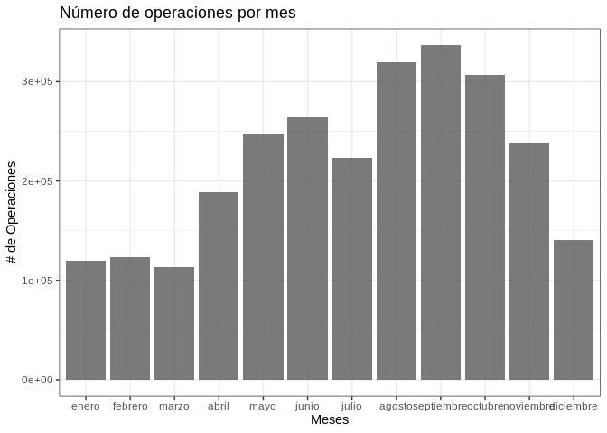<!-- -->

Aquí notamos que agosto, septiembre y octubre son los meses que registran más operaciones , mientras que diciembre ,
enero febrero y marzo registran la menor cantidad de operaciones.


Habiéndo observado el comportamiento de la serie y la cantidad de los registros por mes, ahora queremos mostrar la distribución de la variable *duracion_recorrido*. 

lamentablemente, al observar los primeros registros de esta variable, encontramos que su formato no resulta del todo amigable y que debemos parsearla para retirar el componente de horas, minutos y segundos, a continuación se muestra el formato original de la variable:


```r
bicis_df$duracion_recorrido[1:5] %>% kable()
```


|x                         |
|:-------------------------|
|0 days 00:19:53.000000000 |
|0 days 00:26:19.000000000 |
|0 days 00:27:39.000000000 |
|0 days 00:48:51.000000000 |
|0 days 00:49:27.000000000 |

Dentro de las posibles estrategias de parseo, decidimos la de extraer la componente indicada a partir de la detección de patrones en la variable, empleando expresiones regulares. Luego cohercemos la variable para obtener el resultado
en horas, minutos y segundos, y por último realizamos las operaciones necesarias para conservar el resultado expresado en minutos.


```r
bicis_df$duracion_recorrido <- bicis_df$duracion_recorrido %>%
  str_extract("(\\d{2}:){2}\\d{2}")

bicis_df$duracion_recorrido_minutos <- (hms(bicis_df$duracion_recorrido) %>% 
                                          as.numeric())/60
```

```
## Warning in .parse_hms(..., order = "HMS", quiet = quiet): Some strings failed to
## parse, or all strings are NAs
```


Ya con la variable parseada, procedemos a mostrar el histograma:


```r
ggplot(bicis_df)+
  geom_histogram(aes(x = duracion_recorrido_minutos),
                 col = "white", alpha = .8, bins = 80)+
  theme_bw()+
  ggtitle("Tiempo de uso de ECOBICI")+
  xlab("Minutos")+
  ylab("Número de operaciones")
```

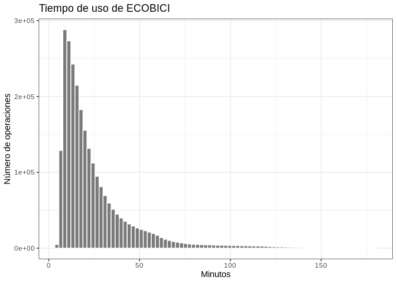<!-- -->

El histograma nos evidencia una clara asimetría positiva en los datos como así también la presencia de outliers.

Con motivo de visualizar la distribución de los datos segmentada por día de semana, procedemos a extraer la componente del día de semana de la variable *fecha_origen_ymd* empleando la función wday del paquete **Lubridate**.

Luegos mostramos un boxplot identificando los días de semana en el eje de abscisas y para mostrar el comportamiento
de los datos, aplicamos una capa de puntos con jitter que posee una muestra aleatoria de los registros.


```r
bicis_df$dia_semana <-  bicis_df$fecha_origen_ymd %>% wday(label = T, abbr = F)

ggplot(bicis_df %>% sample_n(2e4),
       aes(x = dia_semana, y =duracion_recorrido_minutos))+
  geom_boxplot(outlier.colour = NA)+
  geom_jitter(col= "blue", alpha = .05)+
  coord_cartesian(ylim=c(0,75))+
  theme_bw()+
  ggtitle("Duración de viaje por dia de la semana")+
  xlab("Día")+
  ylab("Duración del recorrido (Minutos)")
```

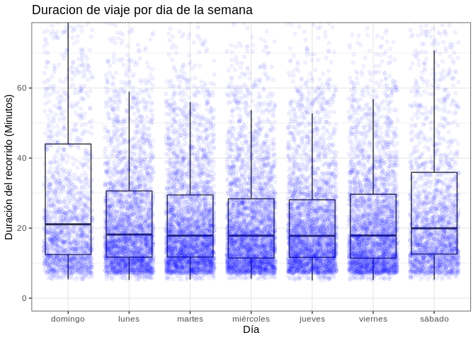<!-- -->

En el gráfico se observa que el percentil 50 de las variables es muy parecido para todos los días de semana pero no lo es para los días Domingo y Sábado. Asimismo notamos mayor dispersión en el fin de semana, como así también la superposición de la capa de puntos con jitter nos muestra que estos días hay menos registros que en el resto de la semana.


Posicionándonos sobre las observaciones extremas, procedemos a identificar los outliers a partir del criterio del rango intercuartil, esto es, consideramos como outlier toda observación cuyo valor se encuentra por encima de 1.5 veces el rango intercuartil y observamos cómo se distribuyen


```r
outliers <- bicis_df %>% 
  filter(duracion_recorrido_minutos > 1.5*IQR(duracion_recorrido_minutos, na.rm = T)+
           quantile(duracion_recorrido_minutos,.75, na.rm = T))
```


```r
ggplot(outliers)+
  geom_histogram(aes(x =duracion_recorrido_minutos), col = " White", binwidth = 3)+
  theme_bw()+
  scale_x_continuous(breaks = seq(60,180,20))+
  ggtitle("Histograma de Outliers")+
  xlab("Duración del recorrido (Minutos)")+
  ylab("Número de operaciones")
```

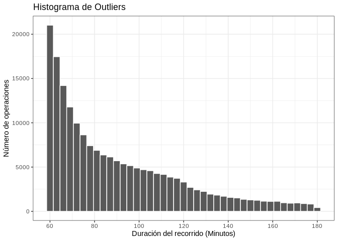<!-- -->


Aquí también se evidencia una fuerte asimetría positiva con valores máximos cercanos a las 3 horas.


Ahora nos enfocamos en uno de los aspectos que consideramos más importantes dentro del análisis exploratorio que es 
la identificación de missing data. para ello, como paso preliminar, computamos la cantidad de observaciones faltantes por variable


```r
map_df(bicis_df, ~ sum(is.na(.))) %>% 
  gather(key = "Variable",value = "Missings") %>% 
  arrange(desc(Missings)) %>% 
  kable()
```


Variable                      Missings
---------------------------  ---------
duracion_recorrido               43723
fecha_destino_recorrido          43723
duracion_recorrido_minutos       43723
id_estacion_destino              30486
long_estacion_destino            30486
lat_estacion_destino             30486
domicilio_estacion_destino       30486
id_estacion_origen               30224
long_estacion_origen             30224
lat_estacion_origen              30224
domicilio_estacion_origen        30224
id_usuario                           0
genero_usuario                       0
fecha_origen_recorrido               0
nombre_estacion_origen               0
nombre_estacion_destino              0
fecha_origen_ymd                     0
dia_semana                           0

Encontramos que los registros faltantes se ubican en las decenas de miles para múltiples variables!
Esto en realidad no resulta tan asombrante dado que contamos con millones de observaciones. Por ello, a continuación mostramos los mismos datos expresados como el porcentaje de completitud de cada variable


```r
map_df(bicis_df, ~ 1- sum(is.na(.))/sum(!(is.na(.)))) %>% 
  gather(key = "Variable",value = "Completitud" ) %>% 
  arrange(Completitud) %>% 
  kable()
```


Variable                      Completitud
---------------------------  ------------
duracion_recorrido              0.9830284
fecha_destino_recorrido         0.9830284
duracion_recorrido_minutos      0.9830284
id_estacion_destino             0.9882270
long_estacion_destino           0.9882270
lat_estacion_destino            0.9882270
domicilio_estacion_destino      0.9882270
id_estacion_origen              0.9883293
long_estacion_origen            0.9883293
lat_estacion_origen             0.9883293
domicilio_estacion_origen       0.9883293
id_usuario                      1.0000000
genero_usuario                  1.0000000
fecha_origen_recorrido          1.0000000
nombre_estacion_origen          1.0000000
nombre_estacion_destino         1.0000000
fecha_origen_ymd                1.0000000
dia_semana                      1.0000000

Ya vimos que la missing data supone menos del 1.2% de las observaciones, pero aún así resulta de la máxima importancia entender qué es lo que ocurre con esos datos faltantes.\n \n

Nos surge la pregunta de si estos datos ausentes no se encuentran disponibles de manera aleatroria o si es que existe algún tipo de patrón en la ausencia de información.

Para testear esto, tratamos de entender las interacciones de los datos faltantes, esto es, evaluar las intersecciones en que distintas de las variables se ausentan de manera simultánea y observar si existe algún patrón en particular o no. Para ello realizamos el siguiente gráfico:


```r
gg_miss_upset(bicis_df %>% select(-duracion_recorrido_minutos), nsets = n_var_miss(bicis_df))
```

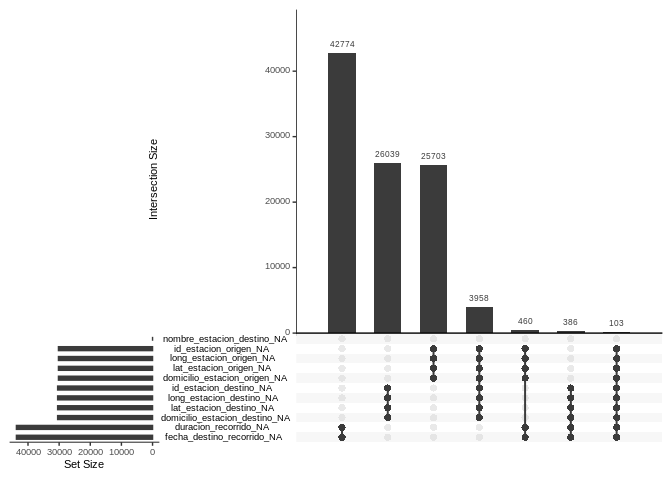<!-- -->

Se observa que  el caso más reiterado es en el que no hay datos de  **fecha_destino_recorrido** ni de **duración_recorrido**,seguido por los casos en que no hay datos del domicilio de la estación de destino ni de sus coordenadas geográficas y ell caso análogo para los datos de origen. \n Otras combinaciones aparecen con menor frecuencia

lo que llama poderosamente la atención en esta visual, es que las observaciones que no disponen
datos de id de estación, cordenadas geográficas y domicilio, sí suelen disponer de nombre
de estación.

Dado este hallazgo, identificaremos los nombres de esas estaciones y en caso de que sea
posible inferir el resto de los datos, procederemos a imputarlos.


```r
bicis_df %>% 
  filter(is.na(id_estacion_origen)) %>% 
  pull(nombre_estacion_origen) %>% table() %>% kable()
```


.                      Freq
-------------------  ------
Ecoparque             15715
Fitz Roy y Gorriti    14509

```r
bicis_df %>% 
  filter(is.na(id_estacion_destino)) %>% 
  pull(nombre_estacion_destino) %>% table() %>% kable()
```


.                      Freq
-------------------  ------
Ecoparque             15946
Fitz Roy y Gorriti    14540

observamos que las estaciones con datos faltantes corresponden a las de Ecoparque
y Fitzroy y Gorriti

De una pequeña búsqueda cursada en google, surge que esas estaciones poseen los siguientes
atributos:


```r
recovered_data <-  data.frame(nombre_de_estacion = c("Ecoparque", "Fitz Roy y Gorriti"),
           id_estacion = c(44, 159),
           latitud = c(-34.575327, -34.584879),
           longitud = c(-58.414603, -58.437229),
           domicilio = c("Av. del Libertador 3260","Fitz Roy y Gorriti"))
```

Ahora imputamos estos datos en nuestro Data Frame


```r
bicis_df[bicis_df$nombre_estacion_origen == "Ecoparque",
         c("nombre_estacion_origen",
           "id_estacion_origen",
           "lat_estacion_origen",
           "long_estacion_origen",
           "domicilio_estacion_origen")] <- recovered_data %>% slice(1) 

bicis_df[bicis_df$nombre_estacion_origen == "Fitz Roy y Gorriti",
         c("nombre_estacion_origen",
           "id_estacion_origen",
           "lat_estacion_origen",
           "long_estacion_origen",
           "domicilio_estacion_origen")] <- recovered_data %>% slice(2) 


bicis_df[bicis_df$nombre_estacion_destino == "Ecoparque",
         c("nombre_estacion_destino",
           "id_estacion_destino",
           "lat_estacion_destino",
           "long_estacion_destino",
           "domicilio_estacion_destino")] <- recovered_data %>% slice(1)

bicis_df[bicis_df$nombre_estacion_destino == "Fitz Roy y Gorriti",
         c("nombre_estacion_destino",
           "id_estacion_destino",
           "lat_estacion_destino",
           "long_estacion_destino",
           "domicilio_estacion_destino")] <- recovered_data %>% slice(2)
```


Si ahora volvemos a evaluar la estructura de los NA observamos lo siguiente:


```r
gg_miss_upset(bicis_df %>% select(-duracion_recorrido_minutos), nsets = n_var_miss(bicis_df))
```

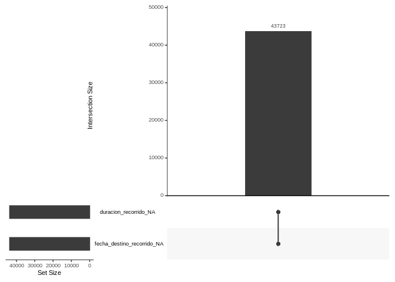<!-- -->

En todos los NA restantes se omiten tanto la duración del recorrido como la fecha de destino
y esta no es información que a priori corresponda imputar.

Para culminar la evaluación de este dataset, procedemos a cohercer la variable género a factor y ofrecemos algunas estadísticas descriptivas


```r
bicis_df$genero_usuario <- as.factor(bicis_df$genero_usuario)
summary(bicis_df)
```

```
##    id_usuario     genero_usuario fecha_origen_recorrido       
##  Min.   :     8   F: 739160      Min.   :2018-01-01 00:08:05  
##  1st Qu.:157791   M:1880740      1st Qu.:2018-05-15 20:29:15  
##  Median :353194   N:     68      Median :2018-08-04 08:12:00  
##  Mean   :328122                  Mean   :2018-07-22 04:21:50  
##  3rd Qu.:491737                  3rd Qu.:2018-10-03 14:09:58  
##  Max.   :672449                  Max.   :2018-12-30 19:52:41  
##                                                               
##  id_estacion_origen nombre_estacion_origen long_estacion_origen
##  Min.   :  1.00     Length:2619968         Min.   :-58.46      
##  1st Qu.: 41.00     Class :character       1st Qu.:-58.42      
##  Median : 91.00     Mode  :character       Median :-58.40      
##  Mean   : 94.99                            Mean   :-58.40      
##  3rd Qu.:146.00                            3rd Qu.:-58.38      
##  Max.   :200.00                            Max.   :-58.36      
##                                                                
##  lat_estacion_origen domicilio_estacion_origen duracion_recorrido
##  Min.   :-34.64      Length:2619968            Length:2619968    
##  1st Qu.:-34.61      Class :character          Class :character  
##  Median :-34.60      Mode  :character          Mode  :character  
##  Mean   :-34.60                                                  
##  3rd Qu.:-34.59                                                  
##  Max.   :-34.57                                                  
##                                                                  
##  fecha_destino_recorrido       id_estacion_destino nombre_estacion_destino
##  Min.   :2018-01-01 00:27:58   Min.   :  1.00      Length:2619968         
##  1st Qu.:2018-05-16 09:02:28   1st Qu.: 42.00      Class :character       
##  Median :2018-08-04 14:40:31   Median : 92.00      Mode  :character       
##  Mean   :2018-07-22 11:36:18   Mean   : 95.32                             
##  3rd Qu.:2018-10-03 16:41:22   3rd Qu.:147.00                             
##  Max.   :2018-12-30 20:04:20   Max.   :200.00                             
##  NA's   :43723                                                            
##  long_estacion_destino lat_estacion_destino domicilio_estacion_destino
##  Min.   :-58.46        Min.   :-34.64       Length:2619968            
##  1st Qu.:-58.42        1st Qu.:-34.61       Class :character          
##  Median :-58.40        Median :-34.60       Mode  :character          
##  Mean   :-58.40        Mean   :-34.60                                 
##  3rd Qu.:-58.38        3rd Qu.:-34.59                                 
##  Max.   :-58.36        Max.   :-34.57                                 
##                                                                       
##  fecha_origen_ymd     duracion_recorrido_minutos     dia_semana    
##  Min.   :2018-01-01   Min.   :  5.00             domingo  :257400  
##  1st Qu.:2018-05-15   1st Qu.: 11.75             lunes    :395736  
##  Median :2018-08-04   Median : 18.22             martes   :426968  
##  Mean   :2018-07-21   Mean   : 25.77             miércoles:432253  
##  3rd Qu.:2018-10-03   3rd Qu.: 30.53             jueves   :412847  
##  Max.   :2018-12-30   Max.   :180.00             viernes  :412845  
##                       NA's   :43723              sábado   :281919
```

Analizando ahora el dataset de usuarios, nos pareció interesante explotar las posibilidades ofrecidas por el mismo a través de un gráfico que exhibiese una piramide poblacional de los usuarios registrados entre 2015 y 2018.

Este se acompaña a continuación:


```r
usuarios_plot <- usuarios_df %>% 
  filter(usuario_sexo %in% c("M","F")) %>% 
  mutate(rango_etario = cut(usuario_edad,breaks = seq(15,100,5))) %>% 
  filter(!is.na(rango_etario)) %>% 
  group_by(usuario_sexo, rango_etario) %>% 
  summarise(total = n())


usuarios_plot$total[usuarios_plot$usuario_sexo == "M"] <-
  -1 * usuarios_plot$total[usuarios_plot$usuario_sexo == "M"]
```


```r
ggplot(usuarios_plot, aes(x = rango_etario, y = total, fill = usuario_sexo))+
  geom_bar(stat = "identity")+
  scale_y_continuous(breaks = seq(-24e3,20e3,4e3),
                     labels =c(seq(24e3,0,-4e3), seq(4e3,20e3,4e3)) )+
  coord_flip()+
  theme_bw()+
  ggtitle("Piramide poblacional de usuarios de ECOBICI")+
  ylab("Número de usuarios")+
  xlab("Rango etario (años)")+
  labs(fill = "Sexo")
```

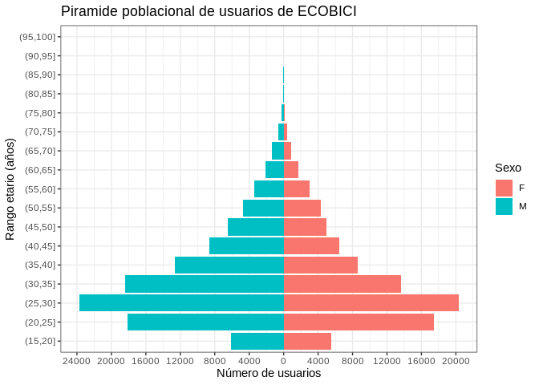<!-- -->


#### 2) Para dar un mejor servicio al usuario, se desea estudiar si (estadísticamente) existe estacionalidad en el uso de la EcoBicis. Una forma de probarlo (y comunicarlo) es construir un gráfico que reporte los intervalos de confianza de la cantidad media de usuarios por cada día de la semana. ¿Hay evidencia estadística de estacionalidad en el uso? Comente.


Para resolver esta consigna, primero estimamos la cantidad total de usuarios por día de semana


```r
operaciones_dia <- operaciones_dia %>% 
  mutate(dia_semana = wday(fecha_origen_ymd,label = T,abbr = F))
```

Luego generamos los intervalos de confianza por día de semana para un nivel de significatividad del 5%


```r
operaciones_dia_summ <- operaciones_dia %>% 
  group_by(dia_semana) %>% 
  summarise(media = mean(registros),
            int_min = t.test(registros,conf.level = .95)$conf.int[1],
            int_max = t.test(registros,conf.level = .95)$conf.int[2])
```

Por último, mostramos los datos obtenidos con un cleveland dot point que nos permite comparar de manera muy clara los intervalos de confianza como así también visualizar la media de cada caso:


```r
ggplot(operaciones_dia_summ, aes(x = fct_rev(dia_semana))) +
  geom_segment( aes(xend=dia_semana, y=int_min, yend=int_max), color="grey") +
  geom_point( aes(y=int_min), color=rgb(0.7,0.2,0.1,0.5), size=3 ) +
  geom_point( aes( y=int_max), color=rgb(0.2,0.7,0.1,0.5), size=3 ) +
  geom_point(aes(y= media), size = 2, shape = 1 )+
  coord_flip()+
  theme_tufte() +
  theme(
    legend.position = "none",
  ) +
  xlab("Día de la semana") +
  ylab("Cantidad de Registros")+
  ggtitle("Intervalos de confianza de registros por día de semana")
```

<!-- -->

Tal como se ha constatado en la visual, para un nivel de significancia del 5%
ünicamente podemos encontrar diferencias significativas en las medias al comparar el
grupo comprendido por los días lunes, martes, mércoles, jueves y viernes, con el comprendido por los
días sábado y domingo.
Es decir, existe superposición de los intevalos de confianza entre los días de semana entre sí, como así
también para los días de los fines de semana entre sí pero no al comparar días de semana con días del
fin de semana.


#### 3) Es sabido que la media se puede ver afectada por la presencia de valores extremos (e.g. feriados). Sobre los datos anteriores se pide que descuente del análisis los días feriados de 2018 y vuelva a construir el gráfico. ¿Cambian los resultados? Comente.


Dado que el dataset no ofrece información acerca de qué días han sido feriados, procedemos a conectarnos a una API de feriados y descargamos un vector con todos los feriados en Argentina del año 2018


```r
feriados <- fromJSON("http://nolaborables.com.ar/api/v2/feriados/2018") %>% 
  transmute(feriado = ymd(paste0("2018-",mes,"-",dia))) %>% 
  pull()
```


Ahora filtramos los datos omitiendo estos días y replicamos el procedimiento realizado en el punto 2)


```r
bicis_df_sf <- bicis_df %>% 
  filter(!(fecha_origen_ymd %in% feriados))


operaciones_dia_summ_sf <- operaciones_dia %>% 
  filter(!(fecha_origen_ymd %in% feriados)) %>% 
  group_by(dia_semana) %>% 
  summarise(media = mean(registros),
            int_min = t.test(registros,conf.level = .95)$conf.int[1],
            int_max = t.test(registros,conf.level = .95)$conf.int[2])
```


```r
ggplot(operaciones_dia_summ_sf, aes(x = fct_rev(dia_semana))) +
  geom_segment( aes(xend=dia_semana, y=int_min, yend=int_max), color="grey") +
  geom_point( aes(y=int_min), color=rgb(0.7,0.2,0.1,0.5), size=3 ) +
  geom_point( aes( y=int_max), color=rgb(0.2,0.7,0.1,0.5), size=3 ) +
  geom_point(aes(y= media), size = 2, shape = 1 )+
  coord_flip()+
  theme_tufte() +
  theme(
    legend.position = "none",
  ) +
  xlab("Día de la semana") +
  ylab("Cantidad de Registros")+
  ggtitle("Intervalos de confianza de registros por día de semana (sin feriados)")
```

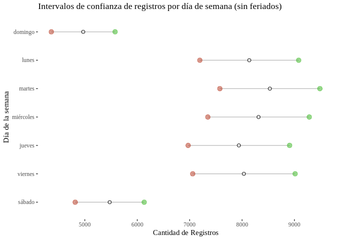<!-- -->


Luego de comparar los resultados y hacer las visualizaciones, encontramos variaciones
que denotan una mayor cantidad de operaciones para todos los días de la semana (excepto jueves
dado que no hubo feriados). En este sentido, las mayores diferencias absolutas se aprecian en los días
lunes y martes. No obstante, dados los nuevos intervalos de confianza, no hay evidencia estadística de
que al remover los feriados haya diferencias en las medias vs contemplando los feriados con un nivel
de significatividad del 5%. Adicionalmente, se siguen presentando diferencias estadísticamente
significativas entre los valores medios de los días de semana y los correspondientes a los fines de semana.


#### 4) Concéntrese en el usuario 606320. en 2018 realizó 95 recorridos. Elimine los casos en que la estación de origen coincide con la de destino para el mismo recorrido. Queremos calcular la velocidad media a la que usualmente se desplaza este ciclista. Cuando trabajamos con velocidades lo correcto es utilizar la media armónica (y no la media aritmética). Calculando la distancia en bici entre las estaciones (use Google Maps) y con el dato de la duración del recorrido (asumiendo que la persona “no interrumpe el recorrido”, lo cual para este usuario resulta razonable), calcule la velocidad media de circulación de dicho usuario. Comente las ventajas de usar la media armónica en lugar de la media aritmética.


Primero identificamos los registros del usuario 606320 con origen distinto a destino y
omitimos los que tienen destino u origen NA


```r
df_606320 <- bicis_df %>% 
  filter(id_usuario == 606320,
         nombre_estacion_origen != nombre_estacion_destino)
```

Con motivo de calcular la distancia entre las estaciones, nos conectamos a la API de Google Drive.

Cada query a la API de Google requiere que nosotros informemos cuál es nuestra API key. Dado que no podemos
compartir nuestra API key, agregamos una línea de código que permita a cualquier usuario seleccionar un documento de
texto de manera local para hacer uso de su propia API key


```r
apiKEY <- read_lines(tcltk::tk_choose.files())
```

Dado que las consultas gratuitas son limitadas, con motivo de minimizar las consultas realizadas, conservamos las combinaciones únicas de origen destino


```r
df_606320_pairs <-  df_606320 %>%
  select(
    id_estacion_origen,
    long_estacion_origen,
    lat_estacion_origen,
    id_estacion_destino,
    long_estacion_destino,
    lat_estacion_destino
  ) %>% 
  unique()
```

Para realizar las consultas a la APi, primero definimos en nuestro entorno global la estructura básica de la API


```r
url_base <- "https://maps.googleapis.com/maps/api/distancematrix/json?"
```

y luego generamos una función que dada la estructura de nuestros datos, permita consultar las coordenadas de origen y destino, obteniendo la distancia expresada en metros


```r
distance_extractor <- function(x){
  url <- paste0(url_base, 
                "origins=",
                x$lat_estacion_origen,",", 
                x$long_estacion_origen, "&destinations=",
                x$lat_estacion_destino, ",",
                x$long_estacion_destino,"&key=",
                apiKEY)
                
  
  
  json <- fromJSON(txt = url)
  
  distance <- json$rows$elements[[1]]$distance$value
   
  return(distance)
}
```

Inicializamos nuestro dataframe vacío


```r
df_distancias <- data.frame()
```

y hacemos un loop para consultar de manera iterativa todas las distancias únicas de nuestro interés


```r
for(i in 1:nrow(df_606320_pairs)){
  
  df <- df_606320_pairs %>% slice(i)
  distancia <- distance_extractor(df)
  
  df_distancias <- rbind(df_distancias, cbind(df,distancia = distancia))
  
}
```


Ahora hacemos un left join para integrar las distancias a los registros originales del usuario


```r
df_606320 <- left_join(df_606320, df_distancias)
```

Luego, generamos una nueva variable *km_h* convirtiendo la distancia a kilómetros y la duración del recorrido a horas


```r
df_606320 <-  df_606320 %>% 
  mutate(km_h = (distancia/1e3)/(duracion_recorrido_minutos/60))
```

y calculamos la media armónica de la velocidad del usuario


```r
harmonic_mean <- function(x){
  (mean(x^(-1)))^(-1)
}

harmonic_mean(df_606320$km_h) 
```

```
## [1] 9.017897
```

Observamos que la velocidad media es de 9 KM/H empleando la media harmónica.\n
No obstante, no son equidistantes los recorridos por lo que resulta conveniente
emplear una media harmónica ponderada por las distancias.


```r
harmonic_weighted_mean <- function(x, weights){
  (sum((weights * x^(-1)))/sum(weights))^(-1)
}

harmonic_weighted_mean(x = df_606320$km_h, weights = df_606320$distancia/1e3 )
```

```
## [1] 9.950994
```

Al usar la media Harmónica ponderada, la velocidad media es de 9.9093 km/h\n \n

El problema de emplear la media aritmética, es que este estadístico
se calcula de manera aditiva y no contempla el hecho de que cuando vamos a una velocidad mayor,
es menor el tiempo que se
transcurre viajando. Consecuentemente, el estadístico suele sobreestimar la velocidad.
En cambio, la media harmónica, al emplear recíprocos,permite anular este efecto,
ya que implícitamente opera con el ratio de horas por km.


#### 5) Una de las estaciones más concurridas es la “009-PARQUE LAS HERAS” y desde allí la mayoría de los usuarios suele dirigirse hasta la estación "066-BILLINGURST". Según Google Maps, entre una estación y otra hay 1.5km y en promedio en bici debería tardarse 8 minutos. Se considera que si un usuario tarda más de 15 minutos es porque hizo escalas en el camino u optó por otro recorrido antes de dejar la bici en su destino final. Evalúe empíricamente si la proporción de usuarios que tardan más de 15 minutos no supera el 20 %.


Primero procedemos a filtrar nuestros datos 


```r
bicis_9_66 <-  bicis_df %>% 
  filter(id_estacion_origen == 9,
         id_estacion_destino == 66,
         !is.na(duracion_recorrido_minutos))
```

hacemos binom test para diferencias en proporciones. Para ello primero armamos un vector con los casos
en que tenemos una duración mayor a 15 minutos y otro para los casos en que la duración es menor. Luego corremos el test


```r
x <-  vector(mode = "integer", length = 2L)
x[1] <- sum(bicis_9_66$duracion_recorrido_minutos > 15)
x[2] <- sum(!bicis_9_66$duracion_recorrido_minutos > 15)
```


```r
binom.test(x = x, p = .2, alternative = "less")
```

```
## 
## 	Exact binomial test
## 
## data:  x
## number of successes = 198, number of trials = 1073, p-value = 0.1088
## alternative hypothesis: true probability of success is less than 0.2
## 95 percent confidence interval:
##  0.0000000 0.2051093
## sample estimates:
## probability of success 
##              0.1845294
```

Al correr este test, encontramos que para un nivel de significancia del 5%, no disponemos de evidencia empírica sufucicente que nos permita rechazar la hipótesis nula de que los usuarios que demoran más de 15 minutos superan el 20% de los registros.


#### 6) Sobre la prueba del punto anterior obtenga la curva de potencia del test. Comente.


Construimos curva de potencia del test


```r
x <- seq(.05,.2,.001)
x_pwr <- pwr.p.test(h = ES.h(x ,.2),n = 1073, alternative = "less" ,sig.level = .05)$power 
plot(x, x_pwr, type = "l",lwd = 2)
```

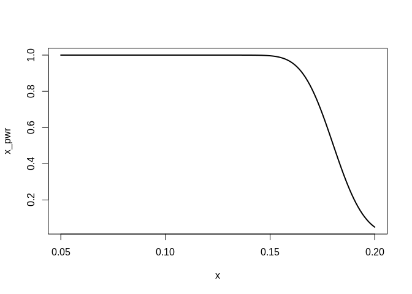<!-- -->


De esta podemos observar de acuerdo a la diferencia real en proporciones, cuál es la probabilidad de rechazo de la hipótesis nula dado que la hipótesis nula es falsa. Se observa de manera bastante más clara cómo a medida que nos separamos de 0,2 hacia la izquierda, aumenta la potencia del test.
   
   
#### 7) En mayo de 2018 se inauguró la estación Facultad de Derecho de la línea H de subtes. ¿Afectó esto al uso de la EcoBici por la zona? Evalúe empíricamente si en la estación “001-FACULTAD DE DERECHO” se registró una diferencia estadísticamente significativa en el uso de las EcoBicis antes y después de la inauguración de la estación de subte. Comente.
   

Consultando wikipedia, encontramos que la inauguración de la estación "Facultad de Derecho" de la línea H, ha sido el 17 de mayo de 2018.

identificamos los registros en que el origen y/o destino haya sido la estación de ecobici
Facultad de Derecho, agrupamos las observaciones por día e identificamos las observaciones posteriores a la inauguración


```r
bicis_fd <- bicis_df %>% 
  filter(id_estacion_origen == 1 | id_estacion_destino == 1) %>% 
  group_by(fecha_origen_ymd) %>% 
  summarise(total = n()) %>% 
  mutate(inaugurado = ifelse(fecha_origen_ymd >= ymd("2018-05-17"),1,0))
```

Primero graficamos la serie identificando el momento en que se ha realizado la inauguración


```r
ggplot(bicis_fd)+
  geom_line(aes(x=fecha_origen_ymd, y = total))+
  geom_vline(xintercept = ymd("2018-05-17"), col = "red")+
  theme_bw()+
  annotate("text",ymd("2018-06-20"),300, 
           label = "Inauguración Línea H \n Facultad de Derecho", size = 3, col= "red")+
  ggtitle("Número de operaciones diarias involucrando estación Facultad de Derecho")+
  xlab("Tiempo")+
  ylab("Número de operaciones")
```

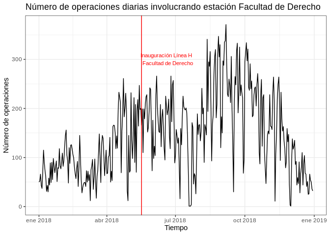<!-- -->

Ahora hacemos un test de diferencia de medias para observar si hay diferencias estadísticamente significativas en el uso del sistema para ese subset de datos con un nivel de significancia del 5%


```r
t.test(x = bicis_fd[bicis_fd$inaugurado ==1,"total"],
       y = bicis_fd[bicis_fd$inaugurado ==0,"total"],
       alternative = "two.sided")
```

```
## 
## 	Welch Two Sample t-test
## 
## data:  bicis_fd[bicis_fd$inaugurado == 1, "total"] and bicis_fd[bicis_fd$inaugurado == 0, "total"]
## t = 9.2104, df = 355.78, p-value < 2.2e-16
## alternative hypothesis: true difference in means is not equal to 0
## 95 percent confidence interval:
##  54.09842 83.47352
## sample estimates:
## mean of x mean of y 
##  170.9119  102.1259
```

Del test surge que la evidencia empírica nos permite rechazar con un nivel de significancia del 5%,  la hipótesis nula de que la cantidad media de recorridos para antes y después de la inauguración de la estación de subte es la misma.


#### 8) Probar si existen diferencias estadísticamente significativas en el uso del sistema de EcoBici por género.


Hacemos un test de medias para evaluar si existen diferencias estadísticamente significativas en el uso de Ecobicis por género


```r
t.test(x = bicis_df[bicis_df$genero_usuario == "M","duracion_recorrido_minutos"],
       y = bicis_df[bicis_df$genero_usuario == "F","duracion_recorrido_minutos"],
       alternative = "two.sided",
       conf.level = .95)
```

```
## 
## 	Welch Two Sample t-test
## 
## data:  bicis_df[bicis_df$genero_usuario == "M", "duracion_recorrido_minutos"] and bicis_df[bicis_df$genero_usuario == "F", "duracion_recorrido_minutos"]
## t = -80.135, df = 1224267, p-value < 2.2e-16
## alternative hypothesis: true difference in means is not equal to 0
## 95 percent confidence interval:
##  -2.704855 -2.575701
## sample estimates:
## mean of x mean of y 
##  25.02425  27.66453
```

Del test surge que con un nivel de significancia del 5% rechazamos la hipótesis nula, indicando que la evidencia sugiere que la diferencia en las medias es mayor a cero.


#### 9) Probar lo mismo que en el punto anterior, pero por grupo etario.


Hacemos un left join de registros con usuarios para saber la edad de cada uno. \n
primero hacemos un anti-join para saber si quedarían registros exceptuados


```r
anti_join(bicis_df, usuarios_df %>% select(usuario_id,usuario_edad) %>% unique(),
          by = c("id_usuario" = "usuario_id")) %>% 
  select(id_usuario) %>% 
  unique() %>% 
  pull() %>% 
  length()
```

```
## [1] 31105
```

De esta operación surge que por más que empleemos todos los usuarios registrados desde 2015, quedan 31105 usuarios que se encuentran en el dataset de operaciones y no se incluyen en el padrón de usuarios registrados.\n \n

Ahora observamos si algun usuario aparece con más de una edad en la tabla de usuarios


```r
usuarios_df %>% 
  select(usuario_id, usuario_edad) %>% 
  unique() %>% 
  group_by(usuario_id) %>% 
  summarise(total = n()) %>% 
  filter(total > 1)
```

```
## # A tibble: 2 x 2
##   usuario_id total
##        <dbl> <int>
## 1     363667     2
## 2     368785     2
```


observamos que esto acontece con dos usuarios. Procedemos a quedarnos con la última observación asociada a cada registro


```r
usuarios_df <- usuarios_df %>% 
  select(usuario_id, usuario_edad) %>% 
  group_by(usuario_id) %>% 
  summarise(usuario_edad = last(usuario_edad)) %>% 
  ungroup()
```

Ahora realizamos el left join y omitimos registros sin edad o con una edad irracionalmente alta     


```r
bicis_df_joined <-  left_join(bicis_df, usuarios_df,by = c("id_usuario" = "usuario_id")) %>% 
  filter(!is.na(usuario_edad),
         !usuario_edad > 100)
```


Para definir el rango etario, vamos a  priorizar un output de grupos 
aproximadamente balanceados por lo que emplearemos los deciles de edad para armar 10 grupos


```r
cuts <- c(as.integer(quantile(bicis_df_joined$usuario_edad, seq(0,1,.1))))
bicis_df_joined$rango_etario <- cut(bicis_df_joined$usuario_edad, breaks = cuts)
```

Para identificar si hay diferencias significativas entre grupos, procedemos a realizar un análisis de varianza y mostramos con un test honesto de tuckey las diferencias entre grupos, idndicando aquellas que han sido estadísticamente significativas con un nivel de significancia del 5%.


```r
aov_rango_etario <- aov(duracion_recorrido_minutos ~ rango_etario , data = bicis_df_joined)
```


```r
TukeyHSD(aov_rango_etario)
```

```
##   Tukey multiple comparisons of means
##     95% family-wise confidence level
## 
## Fit: aov(formula = duracion_recorrido_minutos ~ rango_etario, data = bicis_df_joined)
## 
## $rango_etario
##                         diff         lwr         upr     p adj
## (20,23]-(16,20] -0.466646245 -0.68554874 -0.24774375 0.0000000
## (23,25]-(16,20] -0.377143893 -0.61486258 -0.13942520 0.0000229
## (25,27]-(16,20] -0.369349859 -0.60286979 -0.13582993 0.0000247
## (27,29]-(16,20] -0.373015553 -0.61517161 -0.13085950 0.0000481
## (29,31]-(16,20] -0.907382340 -1.15957464 -0.65519004 0.0000000
## (31,35]-(16,20] -0.962002337 -1.19393756 -0.73006712 0.0000000
## (35,40]-(16,20] -0.496116502 -0.73674435 -0.25548865 0.0000000
## (40,47]-(16,20] -0.220567463 -0.46343625  0.02230132 0.1130906
## (47,96]-(16,20]  1.405913179  1.16731826  1.64450810 0.0000000
## (23,25]-(20,23]  0.089502352 -0.12993701  0.30894172 0.9560582
## (25,27]-(20,23]  0.097296386 -0.11758734  0.31218011 0.9172647
## (27,29]-(20,23]  0.093630692 -0.13060806  0.31786944 0.9491058
## (29,31]-(20,23] -0.440736095 -0.67577740 -0.20569479 0.0000001
## (31,35]-(20,23] -0.495356092 -0.70851661 -0.28219557 0.0000000
## (35,40]-(20,23] -0.029470257 -0.25205782  0.19311731 0.9999938
## (40,47]-(20,23]  0.246078782  0.02107054  0.47108702 0.0192947
## (47,96]-(20,23]  1.872559424  1.65217114  2.09294771 0.0000000
## (25,27]-(23,25]  0.007794034 -0.22622923  0.24181730 1.0000000
## (27,29]-(23,25]  0.004128340 -0.23851314  0.24676982 1.0000000
## (29,31]-(23,25] -0.530238447 -0.78289689 -0.27758000 0.0000000
## (31,35]-(23,25] -0.584858444 -0.81730043 -0.35241646 0.0000000
## (35,40]-(23,25] -0.118972609 -0.36008896  0.12214374 0.8668493
## (40,47]-(23,25]  0.156576430 -0.08677636  0.39992922 0.5736090
## (47,96]-(23,25]  1.783057072  1.54396950  2.02214465 0.0000000
## (27,29]-(25,27] -0.003665694 -0.24219508  0.23486370 1.0000000
## (29,31]-(25,27] -0.538032481 -0.78674450 -0.28932046 0.0000000
## (31,35]-(25,27] -0.592652478 -0.82079861 -0.36450634 0.0000000
## (35,40]-(25,27] -0.126766643 -0.36374444  0.11021116 0.8001982
## (40,47]-(25,27]  0.148782396 -0.09047053  0.38803532 0.6221833
## (47,96]-(25,27]  1.775263038  1.54034976  2.01017632 0.0000000
## (29,31]-(27,29] -0.534366787 -0.79120461 -0.27752896 0.0000000
## (31,35]-(27,29] -0.588986784 -0.82596497 -0.35200860 0.0000000
## (35,40]-(27,29] -0.123100949 -0.36859326  0.12239137 0.8551301
## (40,47]-(27,29]  0.152448090 -0.09524115  0.40013733 0.6363998
## (47,96]-(27,29]  1.778928732  1.53542873  2.02242873 0.0000000
## (31,35]-(29,31] -0.054619997 -0.30184471  0.19260472 0.9995269
## (35,40]-(29,31]  0.411265838  0.15586835  0.66666333 0.0000155
## (40,47]-(29,31]  0.686814876  0.42930495  0.94432480 0.0000000
## (47,96]-(29,31]  2.313295519  2.05981248  2.56677855 0.0000000
## (35,40]-(31,35]  0.465885835  0.23046947  0.70130220 0.0000000
## (40,47]-(31,35]  0.741434874  0.50372844  0.97914131 0.0000000
## (47,96]-(31,35]  2.367915516  2.13457748  2.60125355 0.0000000
## (40,47]-(35,40]  0.275549039  0.02935365  0.52174442 0.0145810
## (47,96]-(35,40]  1.902029681  1.66004940  2.14400996 0.0000000
## (47,96]-(40,47]  1.626480642  1.38227184  1.87068945 0.0000000
```


#### 10) ¡Vamos por el 10! Bootstrapping: dado que la distribución del coeficiente de correlación no es normal ya que está limitada entre -1 y 1, el método bootstrap puede ser muy útil para hacer inferencia sobre dicho parámetro. Para ello, nos centraremos en la correlación entre la edad del usuario de EcoBici y la duración del recorrido para aquellos individuos que hacen el recorrido “Parque Las Heras - Billingurst” (mismos que en el punto 5 del TP). Siga los siguientes pasos para construir el intervalo de confianza del coeficiente de correlación entre dichas variables: 

#### Defina una función ( function() ) que permita calcular el estadístico sobre el cual se quiere realizar el bootstrap. 

#### Utilice la función boot() usando la base de datos de recorridos y la función generada en el paso anterior para tomar 1.000 muestras con reemplazo. 

#### Obtenga el histograma de las estimaciones del bootstrap. Describa. 

#### Utilice la función boot.ci() con la opción "perc" y obtenga el intervalo de confianza al 95 %. Interprete. ¿Resulta estadísticamente significativa la correlaciónentre la duración del recorrido y la edad del ciclista?


Primero definimos subset de datos y la función de bootstrap


```r
bicis_joined_9_66 <-  bicis_df_joined %>% 
  filter(id_estacion_origen == 9,
         id_estacion_destino == 66,
         !is.na(duracion_recorrido_minutos))
```


```r
cor_boot <- function(d,i){
 data <- d[i,]
return(cor(data$usuario_edad,data$duracion_recorrido_minutos))
}
```

seteamos una semilla para asegurar reproducibilidad y hacemos el bootstrap

```r
set.seed(0)
boot_out <- boot(data = bicis_joined_9_66,statistic = cor_boot,R = 1000)
```

Mostramos el histrograma:

```r
ggplot(boot_out$t %>% data.frame(replicates = .), aes(x = replicates))+
  geom_histogram(aes(y =..density..), col = "white", binwidth = .008)+
  geom_density(col = "blue", size = 1, fill = "blue", alpha = .2)+
  theme_bw()+
  ggtitle("Distribución de réplicas bootstrap\n Coef. de Correlación entre edad y minutos de uso")+
  xlab("réplicas")+
  ylab("densidad")
```

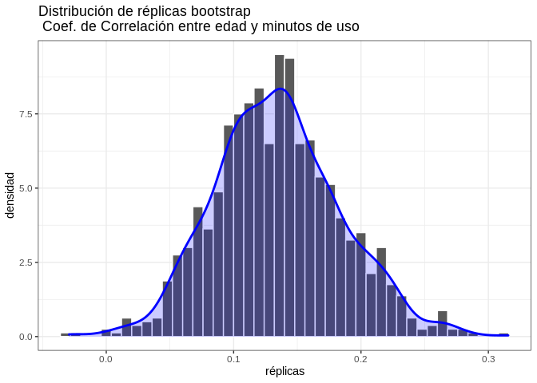<!-- -->

y calculamos el intervalo ed confianza para un nivel de confianza del 95%


```r
boot.ci(boot.out = boot_out, type = "perc",conf = .95) 
```

```
## BOOTSTRAP CONFIDENCE INTERVAL CALCULATIONS
## Based on 1000 bootstrap replicates
## 
## CALL : 
## boot.ci(boot.out = boot_out, conf = 0.95, type = "perc")
## 
## Intervals : 
## Level     Percentile     
## 95%   ( 0.0451,  0.2345 )  
## Calculations and Intervals on Original Scale
```

Encontramos que la evidencia sugiere la existencia de correlación positiva y estadísticamente significativa entre las variables. 

