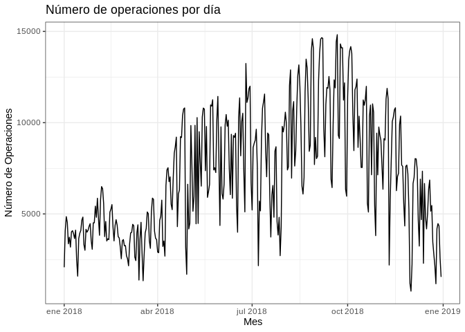

# Trabajo práctico n°1 - ECOBICIS -

#### 1) Descargue los datos de 2018 y a través de gráficos/tabulaciones describa brevemente\n las principales estadísticas relacionadas al uso de la EcoBici.


Primero procedemos a activar los paquetes que vamos a emplear y descargamos los datos a usar
a lo largo del trabajo práctico.


```r
library(tidyverse)
library(lubridate)
library(skimr)
library(rio)
library(naniar)
library(jsonlite)
library(ggthemes)
library(pwr)
library(parsedate)
library(boot)
library(knitr)
```


```r
bicis_df <- read_csv(
  "http://cdn.buenosaires.gob.ar/datosabiertos/datasets/bicicletas-publicas/recorridos-realizados-2018.csv"
)

usuarios_df <- map_df(2015:2018,~ read_csv(paste0(
  "http://cdn.buenosaires.gob.ar/datosabiertos/datasets/bicicletas-publicas/usuarios-ecobici-",
  .x, ".csv")) %>%
    mutate(fecha_alta = parse_date(fecha_alta)))
```

##### Análisis exploratorio de datos

La primer pregunta que nos surgió al descargar estos datasets, fue la de cómo fue evolucionando
la cantidad de operaciones realizadas por día a lo largo del año 2018. Para ello, hemos tenido en cuenta como operaciones cada una de las observaciones.

para ello, primero generamos la variable *fecha_origen_ymd* extrayendo la componente de fecha de la variable
*fecha_origen_ymd*, agrupamos los datos por *fecha_origen_ymd* para calcular los registros diarios y graficamos:


```r
bicis_df$fecha_origen_ymd <- date(bicis_df$fecha_origen_recorrido)

operaciones_dia <- bicis_df %>%
  group_by(fecha_origen_ymd) %>%
  summarise(registros = n())
```


```r
ggplot(operaciones_dia)+
  geom_line(aes(x = fecha_origen_ymd, y = registros))+
  ggtitle("Número de operaciones por día")+
  xlab("Mes")+
  ylab("Número de Operaciones")+
  theme_bw()
```

<!-- -->

