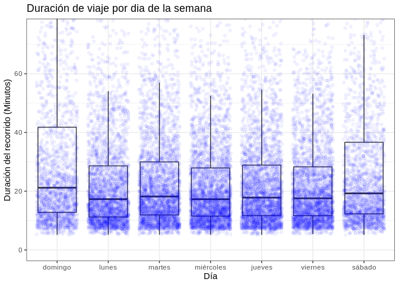
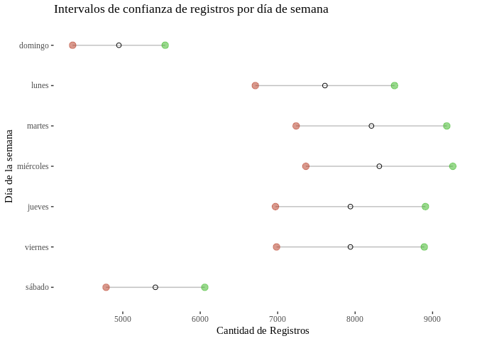

# Trabajo práctico n°1 - ECOBICIS -

#### 1) Descargue los datos de 2018 y a través de gráficos/tabulaciones describa brevemente\n las principales estadísticas relacionadas al uso de la EcoBici.


Primero procedemos a activar los paquetes que vamos a emplear y descargamos los datos a usar
a lo largo del trabajo práctico.


```r
library(tidyverse)
library(lubridate)
library(skimr)
library(rio)
library(naniar)
library(jsonlite)
library(ggthemes)
library(pwr)
library(parsedate)
library(boot)
library(knitr)
```


```r
bicis_df <- read_csv(
  "http://cdn.buenosaires.gob.ar/datosabiertos/datasets/bicicletas-publicas/recorridos-realizados-2018.csv"
)

usuarios_df <- map_df(2015:2018,~ read_csv(paste0(
  "http://cdn.buenosaires.gob.ar/datosabiertos/datasets/bicicletas-publicas/usuarios-ecobici-",
  .x, ".csv")) %>%
    mutate(fecha_alta = parse_date(fecha_alta)))
```

##### Análisis exploratorio de datos

La primer pregunta que nos surgió al descargar estos datasets, fue la de cómo fue evolucionando
la cantidad de operaciones realizadas por día a lo largo del año 2018. Para ello, hemos tenido en cuenta como operaciones cada una de las observaciones.

para ello, primero generamos la variable *fecha_origen_ymd* extrayendo la componente de fecha de la variable
*fecha_origen_ymd*, agrupamos los datos por *fecha_origen_ymd* para calcular los registros diarios y graficamos:


```r
bicis_df$fecha_origen_ymd <- date(bicis_df$fecha_origen_recorrido)

operaciones_dia <- bicis_df %>%
  group_by(fecha_origen_ymd) %>%
  summarise(registros = n())
```


```r
ggplot(operaciones_dia)+
  geom_line(aes(x = fecha_origen_ymd, y = registros))+
  ggtitle("Número de operaciones por día")+
  xlab("Mes")+
  ylab("Número de Operaciones")+
  theme_bw()
```

<!-- -->

Ahora queremos ver el comportamiento de la cantidad de registros por mes para el mismo período,
En este caso, primero extraemos la componente mes de la variable *fecha_origen_ymd* con la función month del paquete **Lubridate**, la cual configuramos para no sólo extraer el mes, sino también para ofrecer el nombre de cada mes como un factor ordenado, lo que resulta de gran utilidad a la hora de graficar.

Después graficamos con un bar plot


```r
operaciones_mes <- bicis_df %>%
  group_by(mes = month(fecha_origen_ymd, label = T, abbr =F)) %>%
  summarise(registros = n())

ggplot(operaciones_mes)+
  geom_col(aes(x = mes, y = registros), alpha=.8)+
  ggtitle("Número de operaciones por mes")+
  xlab("Meses")+
  ylab("# de Operaciones")+
  theme_bw()
```

<!-- -->

Aquí notamos que agosto, septiembre y octubre son los meses que registran más operaciones , mientras que diciembre ,
enero febrero y marzo registran la menor cantidad de operaciones.


Habiéndo observado el comportamiento de la serie y la cantidad de los registros por mes, ahora queremos mostrar la distribución de la variable *duracion_recorrido*. 

lamentablemente, al observar los primeros registros de esta variable, encontramos que su formato no resulta del todo amigable y que debemos parsearla para retirar el componente de horas, minutos y segundos, a continuación se muestra el formato original de la variable:


```r
bicis_df$duracion_recorrido[1:5] %>% kable()
```


|x                         |
|:-------------------------|
|0 days 00:19:53.000000000 |
|0 days 00:26:19.000000000 |
|0 days 00:27:39.000000000 |
|0 days 00:48:51.000000000 |
|0 days 00:49:27.000000000 |

Dentro de las posibles estrategias de parseo, decidimos la de extraer la componente indicada a partir de la detección de patrones en la variable, empleando expresiones regulares. Luego cohercemos la variable para obtener el resultado
en horas, minutos y segundos, y por último realizamos las operaciones necesarias para conservar el resultado expresado en minutos.


```r
bicis_df$duracion_recorrido <- bicis_df$duracion_recorrido %>%
  str_extract("(\\d{2}:){2}\\d{2}")

bicis_df$duracion_recorrido_minutos <- (hms(bicis_df$duracion_recorrido) %>% 
                                          as.numeric())/60
```

```
## Warning in .parse_hms(..., order = "HMS", quiet = quiet): Some strings failed to
## parse, or all strings are NAs
```


Ya con la variable parseada, procedemos a mostrar el histograma:


```r
ggplot(bicis_df)+
  geom_histogram(aes(x = duracion_recorrido_minutos),
                 col = "white", alpha = .8, bins = 80)+
  theme_bw()+
  ggtitle("Tiempo de uso de ECOBICI")+
  xlab("Minutos")+
  ylab("Número de operaciones")
```

<!-- -->

El histograma nos evidencia una clara asimetría positiva en los datos como así también la presencia de outliers.

Con motivo de visualizar la distribución de los datos segmentada por día de semana, procedemos a extraer la componente del día de semana de la variable *fecha_origen_ymd* empleando la función wday del paquete **Lubridate**.

Luegos mostramos un boxplot identificando los días de semana en el eje de abscisas y para mostrar el comportamiento
de los datos, aplicamos una capa de puntos con jitter que posee una muestra aleatoria de los registros.


```r
bicis_df$dia_semana <-  bicis_df$fecha_origen_ymd %>% wday(label = T, abbr = F)

ggplot(bicis_df %>% sample_n(2e4),
       aes(x = dia_semana, y =duracion_recorrido_minutos))+
  geom_boxplot(outlier.colour = NA)+
  geom_jitter(col= "blue", alpha = .05)+
  coord_cartesian(ylim=c(0,75))+
  theme_bw()+
  ggtitle("Duracion de viaje por dia de la semana")+
  xlab("Día")+
  ylab("Duración del recorrido (Minutos)")
```

<!-- -->

En el gráfico se observa que el percentil 50 de las variables es muy parecido para todos los días de semana pero no lo es para los días Domingo y Sábado. Asimismo notamos mayor dispersión en el fin de semana, como así también la superposición de la capa de puntos con jitter nos muestra que estos días hay menos registros que en el resto de la semana.


Posicionándonos sobre las observaciones extremas, procedemos a identificar los outliers a partir del criterio del rango intercuartil, esto es, consideramos como outlier toda observación cuyo valor se encuentra por encima de 1.5 veces el rango intercuartil y observamos cómo se distribuyen


```r
outliers <- bicis_df %>% 
  filter(duracion_recorrido_minutos > 1.5*IQR(duracion_recorrido_minutos, na.rm = T)+
           quantile(duracion_recorrido_minutos,.75, na.rm = T))
```


```r
ggplot(outliers)+
  geom_histogram(aes(x =duracion_recorrido_minutos), col = " White", binwidth = 3)+
  theme_bw()+
  scale_x_continuous(breaks = seq(60,180,20))+
  ggtitle("Histograma de Outliers")+
  xlab("Duración del recorrido (Minutos)")+
  ylab("Número de operaciones")
```

<!-- -->


Aquí también se evidencia una fuerte asimetría positiva con valores máximos cercanos a las 3 horas.


Ahora nos enfocamos en uno de los aspectos que consideramos más importantes dentro del análisis exploratorio que es 
la identificación de missing data. para ello, como paso preliminar, computamos la cantidad de observaciones faltantes por variable


```r
map_df(bicis_df, ~ sum(is.na(.))) %>% 
  gather(key = "Variable",value = "Missings") %>% 
  arrange(desc(Missings)) %>% 
  kable()
```


Variable                      Missings
---------------------------  ---------
duracion_recorrido               43723
fecha_destino_recorrido          43723
duracion_recorrido_minutos       43723
id_estacion_destino              30486
long_estacion_destino            30486
lat_estacion_destino             30486
domicilio_estacion_destino       30486
id_estacion_origen               30224
long_estacion_origen             30224
lat_estacion_origen              30224
domicilio_estacion_origen        30224
id_usuario                           0
genero_usuario                       0
fecha_origen_recorrido               0
nombre_estacion_origen               0
nombre_estacion_destino              0
fecha_origen_ymd                     0
dia_semana                           0

Encontramos que los registros faltantes se ubican en las decenas de miles para múltiples variables!
Esto en realidad no resulta tan asombrante dado que contamos con millones de observaciones. Por ello, a continuación mostramos los mismos datos expresados como el porcentaje de completitud de cada variable


```r
map_df(bicis_df, ~ 1- sum(is.na(.))/sum(!(is.na(.)))) %>% 
  gather(key = "Variable",value = "Completitud" ) %>% 
  arrange(Completitud) %>% 
  kable()
```


Variable                      Completitud
---------------------------  ------------
duracion_recorrido              0.9830284
fecha_destino_recorrido         0.9830284
duracion_recorrido_minutos      0.9830284
id_estacion_destino             0.9882270
long_estacion_destino           0.9882270
lat_estacion_destino            0.9882270
domicilio_estacion_destino      0.9882270
id_estacion_origen              0.9883293
long_estacion_origen            0.9883293
lat_estacion_origen             0.9883293
domicilio_estacion_origen       0.9883293
id_usuario                      1.0000000
genero_usuario                  1.0000000
fecha_origen_recorrido          1.0000000
nombre_estacion_origen          1.0000000
nombre_estacion_destino         1.0000000
fecha_origen_ymd                1.0000000
dia_semana                      1.0000000

Ya vimos que la missing data supone menos del 1.2% de las observaciones, pero aún así resulta de la máxima importancia entender qué es lo que ocurre con esos datos faltantes.\n \n

Nos surge la pregunta de si estos datos ausentes no se encuentran disponibles de manera aleatroria o si es que existe algún tipo de patrón en la ausencia de información.

Para testear esto, tratamos de entender las interacciones de los datos faltantes, esto es, evaluar las intersecciones en que distintas de las variables se ausentan de manera simultánea y observar si existe algún patrón en particular o no. Para ello realizamos el siguiente gráfico:


```r
gg_miss_upset(bicis_df %>% select(-duracion_recorrido_minutos), nsets = n_var_miss(bicis_df))
```

<!-- -->

Se observa que  el caso más reiterado es en el que no hay datos de  **fecha_destino_recorrido** ni de **duración_recorrido**,seguido por los casos en que no hay datos del domicilio de la estación de destino ni de sus coordenadas geográficas y ell caso análogo para los datos de origen. \n Otras combinaciones aparecen con menor frecuencia

lo que llama poderosamente la atención en esta visual, es que las observaciones que no disponen
datos de id de estación, cordenadas geográficas y domicilio, sí suelen disponer de nombre
de estación.

Dado este hallazgo, identificaremos los nombres de esas estaciones y en caso de que sea
posible inferir el resto de los datos, procederemos a imputarlos.


```r
bicis_df %>% 
  filter(is.na(id_estacion_origen)) %>% 
  pull(nombre_estacion_origen) %>% table() %>% kable()
```


.                      Freq
-------------------  ------
Ecoparque             15715
Fitz Roy y Gorriti    14509

```r
bicis_df %>% 
  filter(is.na(id_estacion_destino)) %>% 
  pull(nombre_estacion_destino) %>% table() %>% kable()
```


.                      Freq
-------------------  ------
Ecoparque             15946
Fitz Roy y Gorriti    14540

observamos que las estaciones con datos faltantes corresponden a las de Ecoparque
y Fitzroy y Gorriti

De una pequeña búsqueda cursada en google, surge que esas estaciones poseen los siguientes
atributos:


```r
recovered_data <-  data.frame(nombre_de_estacion = c("Ecoparque", "Fitz Roy y Gorriti"),
           id_estacion = c(44, 159),
           latitud = c(-34.575327, -34.584879),
           longitud = c(-58.414603, -58.437229),
           domicilio = c("Av. del Libertador 3260","Fitz Roy y Gorriti"))
```

Ahora imputamos estos datos en nuestro Data Frame


```r
bicis_df[bicis_df$nombre_estacion_origen == "Ecoparque",
         c("nombre_estacion_origen",
           "id_estacion_origen",
           "lat_estacion_origen",
           "long_estacion_origen",
           "domicilio_estacion_origen")] <- recovered_data %>% slice(1) 

bicis_df[bicis_df$nombre_estacion_origen == "Fitz Roy y Gorriti",
         c("nombre_estacion_origen",
           "id_estacion_origen",
           "lat_estacion_origen",
           "long_estacion_origen",
           "domicilio_estacion_origen")] <- recovered_data %>% slice(2) 


bicis_df[bicis_df$nombre_estacion_destino == "Ecoparque",
         c("nombre_estacion_destino",
           "id_estacion_destino",
           "lat_estacion_destino",
           "long_estacion_destino",
           "domicilio_estacion_destino")] <- recovered_data %>% slice(1)

bicis_df[bicis_df$nombre_estacion_destino == "Fitz Roy y Gorriti",
         c("nombre_estacion_destino",
           "id_estacion_destino",
           "lat_estacion_destino",
           "long_estacion_destino",
           "domicilio_estacion_destino")] <- recovered_data %>% slice(2)
```


Si ahora volvemos a evaluar la estructura de los NA observamos lo siguiente:


```r
gg_miss_upset(bicis_df %>% select(-duracion_recorrido_minutos), nsets = n_var_miss(bicis_df))
```

<!-- -->

En todos los NA restantes se omiten tanto la duración del recorrido como la fecha de destino
y esta no es información que a priori corresponda imputar.

Para culminar la evaluación de este dataset, procedemos a cohercer la variable género a factor y ofrecemos algunas estadísticas descriptivas


```r
bicis_df$genero_usuario <- as.factor(bicis_df$genero_usuario)
summary(bicis_df)
```

```
##    id_usuario     genero_usuario fecha_origen_recorrido       
##  Min.   :     8   F: 739160      Min.   :2018-01-01 00:08:05  
##  1st Qu.:157791   M:1880740      1st Qu.:2018-05-15 20:29:15  
##  Median :353194   N:     68      Median :2018-08-04 08:12:00  
##  Mean   :328122                  Mean   :2018-07-22 04:21:50  
##  3rd Qu.:491737                  3rd Qu.:2018-10-03 14:09:58  
##  Max.   :672449                  Max.   :2018-12-30 19:52:41  
##                                                               
##  id_estacion_origen nombre_estacion_origen long_estacion_origen
##  Min.   :  1.00     Length:2619968         Min.   :-58.46      
##  1st Qu.: 41.00     Class :character       1st Qu.:-58.42      
##  Median : 91.00     Mode  :character       Median :-58.40      
##  Mean   : 94.99                            Mean   :-58.40      
##  3rd Qu.:146.00                            3rd Qu.:-58.38      
##  Max.   :200.00                            Max.   :-58.36      
##                                                                
##  lat_estacion_origen domicilio_estacion_origen duracion_recorrido
##  Min.   :-34.64      Length:2619968            Length:2619968    
##  1st Qu.:-34.61      Class :character          Class :character  
##  Median :-34.60      Mode  :character          Mode  :character  
##  Mean   :-34.60                                                  
##  3rd Qu.:-34.59                                                  
##  Max.   :-34.57                                                  
##                                                                  
##  fecha_destino_recorrido       id_estacion_destino nombre_estacion_destino
##  Min.   :2018-01-01 00:27:58   Min.   :  1.00      Length:2619968         
##  1st Qu.:2018-05-16 09:02:28   1st Qu.: 42.00      Class :character       
##  Median :2018-08-04 14:40:31   Median : 92.00      Mode  :character       
##  Mean   :2018-07-22 11:36:18   Mean   : 95.32                             
##  3rd Qu.:2018-10-03 16:41:22   3rd Qu.:147.00                             
##  Max.   :2018-12-30 20:04:20   Max.   :200.00                             
##  NA's   :43723                                                            
##  long_estacion_destino lat_estacion_destino domicilio_estacion_destino
##  Min.   :-58.46        Min.   :-34.64       Length:2619968            
##  1st Qu.:-58.42        1st Qu.:-34.61       Class :character          
##  Median :-58.40        Median :-34.60       Mode  :character          
##  Mean   :-58.40        Mean   :-34.60                                 
##  3rd Qu.:-58.38        3rd Qu.:-34.59                                 
##  Max.   :-58.36        Max.   :-34.57                                 
##                                                                       
##  fecha_origen_ymd     duracion_recorrido_minutos     dia_semana    
##  Min.   :2018-01-01   Min.   :  5.00             domingo  :257400  
##  1st Qu.:2018-05-15   1st Qu.: 11.75             lunes    :395736  
##  Median :2018-08-04   Median : 18.22             martes   :426968  
##  Mean   :2018-07-21   Mean   : 25.77             miércoles:432253  
##  3rd Qu.:2018-10-03   3rd Qu.: 30.53             jueves   :412847  
##  Max.   :2018-12-30   Max.   :180.00             viernes  :412845  
##                       NA's   :43723              sábado   :281919
```

Analizando ahora el dataset de usuarios, nos pareció interesante explotar las posibilidades ofrecidas por el mismo a través de un gráfico que exhibiese una piramide poblacional de los usuarios registrados entre 2015 y 2018.

Este se acompaña a continuación:


```r
usuarios_plot <- usuarios_df %>% 
  filter(usuario_sexo %in% c("M","F")) %>% 
  mutate(rango_etario = cut(usuario_edad,breaks = seq(15,100,5))) %>% 
  filter(!is.na(rango_etario)) %>% 
  group_by(usuario_sexo, rango_etario) %>% 
  summarise(total = n())


usuarios_plot$total[usuarios_plot$usuario_sexo == "M"] <-
  -1 * usuarios_plot$total[usuarios_plot$usuario_sexo == "M"]
```


```r
ggplot(usuarios_plot, aes(x = rango_etario, y = total, fill = usuario_sexo))+
  geom_bar(stat = "identity")+
  scale_y_continuous(breaks = seq(-24e3,20e3,4e3),
                     labels =c(seq(24e3,0,-4e3), seq(4e3,20e3,4e3)) )+
  coord_flip()+
  theme_bw()+
  ggtitle("Piramide poblacional de usuarios de ECOBICI")+
  ylab("Número de usuarios")+
  xlab("Rango etario (años)")+
  labs(fill = "Sexo")
```

<!-- -->

#### 2) Para dar un mejor servicio al usuario, se desea estudiar si (estadísticamente) existe estacionalidad en el uso de la EcoBicis. Una forma de probarlo (y comunicarlo) es construir un gráfico que reporte los intervalos de confianza de la cantidad media de usuarios por cada día de la semana. ¿Hay evidencia estadística de estacionalidad en el uso? Comente.

Para resolver esta consigna, primero estimamos la cantidad total de usuarios por día de semana


```r
operaciones_dia <- operaciones_dia %>% 
  mutate(dia_semana = wday(fecha_origen_ymd,label = T,abbr = F))
```

Luego generamos los intervalos de confianza por día de semana para un nivel de significatividad del 5%


```r
operaciones_dia_summ <- operaciones_dia %>% 
  group_by(dia_semana) %>% 
  summarise(media = mean(registros),
            int_min = t.test(registros,conf.level = .95)$conf.int[1],
            int_max = t.test(registros,conf.level = .95)$conf.int[2])
```

Por último, mostramos los datos obtenidos con un cleveland dot point que nos permite comparar de manera muy clara los intervalos de confianza como así también visualizar la media de cada caso:


```r
ggplot(operaciones_dia_summ, aes(x = fct_rev(dia_semana))) +
  geom_segment( aes(xend=dia_semana, y=int_min, yend=int_max), color="grey") +
  geom_point( aes(y=int_min), color=rgb(0.7,0.2,0.1,0.5), size=3 ) +
  geom_point( aes( y=int_max), color=rgb(0.2,0.7,0.1,0.5), size=3 ) +
  geom_point(aes(y= media), size = 2, shape = 1 )+
  coord_flip()+
  theme_tufte() +
  theme(
    legend.position = "none",
  ) +
  xlab("Día de la semana") +
  ylab("Cantidad de Registros")+
  ggtitle("Intervalos de confianza de registros medios por día de semana")
```

<!-- -->

Tal como se ha constatado en la visual, para un nivel de significancia del 5%
ünicamente podemos encontrar diferencias significativas en las medias al comparar el
grupo comprendido por los días lunes, martes, mércoles, jueves y viernes, con el comprendido por los
días sábado y domingo.
Es decir, existe superposición de los intevalos de confianza entre los días de semana entre sí, como así
también para los días de los fines de semana entre sí pero no al comparar días de semana con días del
fin de semana.

#### 3) Es sabido que la media se puede ver afectada por la presencia de valores extremos (e.g. feriados). Sobre los datos anteriores se pide que descuente del análisis los días feriados de 2018 y vuelva a construir el gráfico. ¿Cambian los resultados? Comente.


Dado que el dataset no ofrece información acerca de qué días han sido feriados, procedemos a conectarnos a una API de feriados y descargamos un vector con todos los feriados en Argentina del año 2018


```r
feriados <- fromJSON("http://nolaborables.com.ar/api/v2/feriados/2018") %>% 
  transmute(feriado = ymd(paste0("2018-",mes,"-",dia))) %>% 
  pull()
```


Ahora filtramos los datos omitiendo estos días y replicamos el procedimiento realizado en el punto 2)


```r
bicis_df_sf <- bicis_df %>% 
  filter(!(fecha_origen_ymd %in% feriados))


operaciones_dia_summ_sf <- operaciones_dia %>% 
  filter(!(fecha_origen_ymd %in% feriados)) %>% 
  group_by(dia_semana) %>% 
  summarise(media = mean(registros),
            int_min = t.test(registros,conf.level = .95)$conf.int[1],
            int_max = t.test(registros,conf.level = .95)$conf.int[2])
```


```r
ggplot(operaciones_dia_summ_sf, aes(x = fct_rev(dia_semana))) +
  geom_segment( aes(xend=dia_semana, y=int_min, yend=int_max), color="grey") +
  geom_point( aes(y=int_min), color=rgb(0.7,0.2,0.1,0.5), size=3 ) +
  geom_point( aes( y=int_max), color=rgb(0.2,0.7,0.1,0.5), size=3 ) +
  geom_point(aes(y= media), size = 2, shape = 1 )+
  coord_flip()+
  theme_tufte() +
  theme(
    legend.position = "none",
  ) +
  xlab("Día de la semana") +
  ylab("Cantidad de Registros")+
  ggtitle("Intervalos de confianza de registros medios por día de semana (sin feriados)")
```

<!-- -->


Luego de comparar los resultados y hacer las visualizaciones, encontramos variaciones
que denotan una mayor cantidad de operaciones para todos los días de la semana (excepto jueves
dado que no hubo feriados). En este sentido, las mayores diferencias absolutas se aprecian en los días
lunes y martes. No obstante, dados los nuevos intervalos de confianza, no hay evidencia estadística de
que al remover los feriados haya diferencias en las medias vs contemplando los feriados con un nivel
de significatividad del 5%. Adicionalmente, se siguen presentando diferencias estadísticamente
significativas entre los valores medios de los días de semana y los correspondientes a los fines de semana.

#### 4) Concéntrese en el usuario 606320. en 2018 realizó 95 recorridos. Elimine los casos en que la estación de origen coincide con la de destino para el mismo recorrido. Queremos calcular la velocidad media a la que usualmente se desplaza este ciclista. Cuando trabajamos con velocidades lo correcto es utilizar la media armónica (y no la media aritmética). Calculando la distancia en bici entre las estaciones (use Google Maps) y con el dato de la duración del recorrido (asumiendo que la persona “no interrumpe el recorrido”, lo cual para este usuario resulta razonable), calcule la velocidad media de circulación de dicho usuario. Comente las ventajas de usar la media armónica en lugar de la media aritmética.


